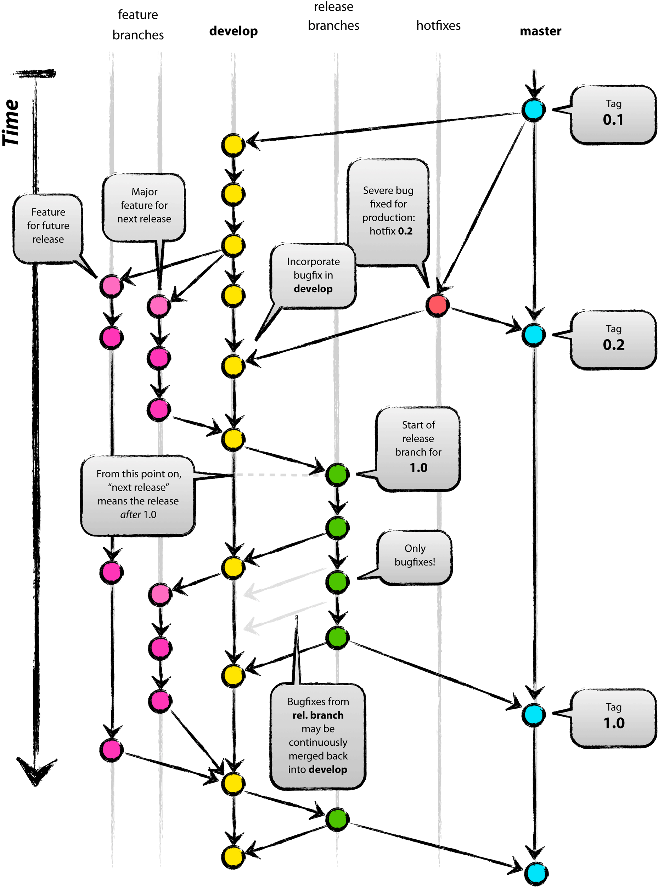

# Git开发规范


## 基本开发流程


### 配置ssh key(针对未使用过git的同学)


> 使用git开发时，建议使用ssh key作验证，而不是用户名/密码(即不安全，也不方便)；

+ 在本机上生成ssh key密钥对：

	+ `*nix`平台：

		```
		### 一路回车，会在~/.ssh中生成ssh key对
		ssh-keygen -t rsa

		ll ~/.ssh
		id_rsa		# 私钥，自己保存
		id_rsa.pub  # 公钥，在git平台中设置
		```

	+ `Windows`平台：

		+ 先下载并安装<a href="https://git-scm.com/download/win" target="_blank">git安装包</a>；

		+ 使用git安装目录中的```git-bash.exe```生成密钥对：

			```
			ssh-keygen -t rsa
			```

		+ 此时会在`C:\Users\${username}\.ssh`下生成`id_rsa`及`id_rsa.pub`文件。
	

+ 在git平台上设置自己的公钥(id_rsa.pub)：

	


### 在日常使用Git开发过程中，为了尽量减少冲突及一些上线风险，我们大致会遵循如图所示的开发流程



### 分支说明

分支 | 规范名称 | 描述
------------- | ------------- | -------------
master   | master  | 稳定分支，将会发布在**生产**或**预发布**环境中
develop  | develop | 非稳定分支，将会发布在**测试**环境
feature_xxx  | ```feature_$developer_$description_$yyyyMMdd```，如```feature_haolin_userinfo_20170103``` | 功能开发分支，需要从最新master中checkout，开发完成后，需先merge到develop分支，测试通过后，再merge到master分支，执行上线
hotfix_xxx  | ```hotfix_$developer_$description_$yyyyMMdd```，如```hotfix_haolin_userinfo_20170103``` | 线上bug修复分支，需要从最新master中checkout，开发完成后，需先merge到develop分支，测试通过后，再merge到master分支，执行上线
release_xxx   | ```release_$version```，如```release_1.0.0```  | master分支的标签，作为版本历史，可用于备份，回滚等操作


## git基本命令

+ 克隆仓库：

	```bash
	git clone remote_url
	```

+ 拉取当前分支最新代码：

	```bash
	git fetch
	```

+ 拉取当前分支最新代码并作合并：

	```bash
	git pull
	```	

+ 合并某分支到当前分支：

	```bash
	git merge branch_name
	``` 

+ 切换分支：

	```bash
	# 切换到一个已存在的分支
	git checkout branch_name
	# 从当前分支切出一个新分支
	git checkout -b new_branch_name
	```

+ 提交当前更新到本地仓库：

	```bash
	git add .
	git commit -m "简短准确的描述"
	```

+ 推送本地仓库到远端仓库：

	```bash
	git push remote_origin local_branch_name
	```

+ 建议初学者都读一遍<a href="http://www.ruanyifeng.com/blog/2015/12/git-workflow.html" target="_blank">该文章</a>，及<a href="https://git.oschina.net/progit/" target="_blank">参考指南</a>。

## 开发时常用的Git操作流程

> 在开发功能时，平时经常使用的命令并不那么多，简单的几个就足以应付，但保持良好的git操作习惯，将会有效避免后期一些分支冲突，上线风险等问题，下面介绍一些常用的操作流。

+ 开发新功能git流程：

	+ 切出新功能分支：
		
		```bash
		# 切换到master分支
		git checkout master
		
		# 更新master最新代码
		git pull origin master
		
		# 切出新功能分支
		git checkout -b feature_haolin_userinfo_20170103
		```
	
	+ 开发完成后，合并分支代码到develop分支，部署发布并测试：

		```bash
		# 切换到非稳定分支develop
		git checkout develop
		# 拉取最新的代码
		git pull 
		# 合并自己的分支到develop，并解决必要的冲突
		git merge feature_haolin_userinfo_20170103
		# 推送最新代码到develop
		git push 
		```

	+ 测试通过后，合并分支代码到master分支，部署上线：

		```bash
		# 切换到稳定分支master
		git checkout master
		# 拉取最新的代码
		git pull 
		# 合并自己的分支到master，并解决必要的冲突
		git merge feature_haolin_userinfo_20170103
		# 推送最新代码到master
		git push 
		```

+ 修复线上bug的git流程，同理，名称前缀改为```hotfix```即可。

## Git常用Tips

> 在使用版本管理工具时，重要的是良好的规范和习惯，这会为后面的维护管理带来极大的方便和可靠性。

1. 定期同步最新的master代码：

	+ 开发新功能前，均应pull最新master代码，再checkout新分支；

	+ 开发新功能过程中，应定期(如每天)pull最新master代码(有可能其他开发人员上线了新功能)，并合并到自己正在开发的分支上；


2. 在建立git项目前，注意在项目根目录添加`.gitignore`文件，定义一些系统，IDE相关的文件信息，例如下面的模版：

	```git
	# Compiled source #
	###################
	*.com
	*.class
	*.dll
	*.exe
	*.o
	*.so
	
	# Packages #
	############
	# it's better to unpack these files and commit the raw source
	# git has its own built in compression methods
	*.7z
	*.dmg
	*.gz
	*.iso
	*.jar
	*.rar
	*.tar
	*.zip
	
	# Logs and databases #
	######################
	*.log
	
	# OS generated files #
	######################
	.DS_Store*
	ehthumbs.db
	#Icon?
	Thumbs.db
	
	# Editor Files #
	################
	*~
	*.swp
	
	# Gradle Files #
	################
	.gradle
	
	# Build output directies
	/target
	*/target
	/build
	*/build
	/generated-sources
	*/generated-sources
	*Thunderbolt/core/generated-sources/*
	var
	logs
	
	
	# IntelliJ specific files/directories
	.idea
	out
	*.ipr
	*.iws
	*.iml
	atlassian-ide-plugin.xml
	
	# Eclipse specific files/directories
	.classpath
	.project
	.settings
	.metadata
	.recommenders
	
	# NetBeans specific files/directories
	.nbattrs
	*.orig
	
	*.versionsBackup
	
	server_log_home_IS_UNDEFINED

	.svn
	```