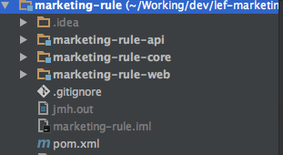

# Java开发规范

## 编程规范

### 命名规范

1. **`强制`**代码中的命名均**<font color="red">不能</font>**以~~下划线~~或~~美元符号~~开始，也不能以~~下划线~~或~~美元符号~~结束，如：

	```java
	_name / __name / $Object / name_ / name$ / Object$
	```

2. **`强制`**代码中的命名应使用**<font color="green">英文</font>**的方式，而不是~~拼音~~；

3. **`强制`**类名使用 **UpperCamelCase** 风格，必须遵从**驼峰形式**，但以下情形例外:(领域模型 的相关命名)DTO / VO等；

4. **`强制`**方法名、参数名、成员变量、局部变量都统一使用 **lowerCamelCase** 风格，必须遵从**驼峰**形式；

5. **`强制`**常量命名全部大写，单词间用下划线隔开，力求语义表达完整清楚，不要嫌名字长；

6. **`强制`**抽象类命名使用 **Abstract** 或 **Base** 开头，异常类命名使用 **Exception** 结尾，单元测试类命名以它要测试的类的名称开始，以 **Test** 结尾；

7. **`强制`**PO中布尔类型的属性，无需加~~is~~或者~~has~~等前缀，如~~isFirst~~，~~hasFinish~~等；

8. **`强制`**对于 **Service** 和 **Dao** 类，由于基于服务化的开发，暴露出来的服务一定是接口，内部的实现类在对应接口加上 **Impl** 后缀，如：

9. **`强制`**枚举类成员名称需要**全大写**，单词间用**下划线**隔开；

### 常量定义

1. **`强制`**long 或者 Long 初始赋值时，必须使用大写的 **L**，不能是小写的 l；

2. **`建议`**不要使用一个常量类维护所有常量，应该按常量功能进行归类，分开维护。如:缓存相关的常量放在类**CacheConsts**下，系统配置相关的常量放在类**ConfigConsts**下；

3. **`建议`**如果变量值仅在可枚举的范围内变化，可用**Enum**类。如果还带有名称之外的延伸属性，必须使用**Enum**类，**Enum**类建议均放在带**enums**的包中，如：

	```java
	package com.le.jr.usercenter.enums;
	
	public enum UserStatus {
	
	    /**
	     * normal
	     */
	    NORMAL(1),
	
	    /**
	     * forbidden
	     */
	    FORBIDDEN(2);
	
	    private Integer value;
	
	    UserStatus(Integer value){
	        this.value = value;
	    }
	
	    public Integer value(){
	        return value;
	    }
	
	    public static UserStatus from(Integer status){
	        for (UserStatus s : UserStatus.values()){
	            if (Objects.equals(s.value, status)){
	                return s;
	            }
	        }
	        throw new IllegalStateException("invalid user status value: " + status);
	    }
	}
	```

### 格式规范

1. **`强制`**if/for/while/switch/do 等保留字与左右括号之间都必须加空格，如：

	```java
	if (a > b) {
		// ... 
	}
	
	for (int i = 0; i < 10; i++) {
		// ...
	}
	
	```
	
2. **`强制`**任何运算符左右必须**加一个空格**;
3. **`强制`**方法参数在定义和传入时，多个参数逗号后边必须加空格，如：
	
	```java
	methodOne(String a, Integer b);
	```
	
4. **`强制`**IDE的**text file encoding**设置为**UTF-8**; IDE中文件的换行符使用**Unix**格式， 不要使用 **windows** 格式;
5. **`建议`**方法体内的执行语句组、变量的定义语句组、不同的业务逻辑块之间或者不同的语义之间插入一个空行：

	```java
	public boolean userLogin(String username, String plainPassword){
		
		// 查询合法用户
		User user = findUserByUsername(username);
		if (user == null) {
			// throw ...
		}
		
		// 校验用户状态
		checkUserStatus(user);
		
		// 校验密码
		String encrypted = encrypt(plainPassword);
		if (!user.getPassword().equals(encrypted)) {
			// throw ...
		}
		
		// ...
	}
	
	```

### OOP规范

1. **`强制`**避免通过一个类的对象引用访问此类的静态变量或静态方法，直接使用**类名**即可;

2. **`强制`**所有的重写方法，必须加**@Override**注解;

3. **`强制`**对外暴露的接口签名，原则上**不允许修改方法签名**，避免对接口调用方产生影响。接口过时必须加**@Deprecated**注解，并清晰地说明采用的新接口或者新服务是什么，而且老接口应作**兼容处理**;

4. **`强制`**不能使用~~过时的类~~或~~方法~~;

5. **`强制`**所有的相同类型的包装类对象之间值的比较，全部使用 **equals** 方法比较;

6. **`强制`**关于**基本数据类型**与**包装数据类型**的使用标准如下：

	6.1 所有的PO/VO/DTO等类属性必须使用**包装数据类型**；
	
	6.2 PC方法的返回值和参数必须使用**包装数据类型**；
	
	6.3 所有的**局部变量**【建议】使用**基本数据类型**，可节约部分内存。

7. **`强制`**构造方法里面禁止加入任何业务逻辑，如果有初始化逻辑，请放在 **init** 方法中;

8. **`强制`**POJO 类必须写 **toString** 方法。可使用 IDE 的中工具生成，如果继承了另一个 POJO 类，注意在前面加一下 **super.toString()**，**toString** 方法这可以在日志打印时用上，而不是手动作~~JSON化~~或~~逐个获取属性~~;

9. **`强制`**当一个类有多个构造方法，或者多个同名方法，这些方法应该**按顺序放置**在一起，便于阅读;

10. **`建议`**循环体内，字符串的联接方式，使用 **StringBuilder** 的 append 方法进行扩展，可**节约内存资源**;

11. **`建议`** **final**可提高程序响应效率，声明成 **final** 的情况：
	
	11.1 不需要重新赋值的变量，包括类属性、局部变量；
	
	11.2 对象参数前加final，表示不允许修改引用的指向；
	
	11.3 类方法确定不允许被重写。 

12. **`建议`**严格控制**类成员**与**方法访问**，这样作既是约束使用者的使用规范，也避免给使用者带来使用上的困惑，如：

	12.1 如果不允许外部直接通过new来创建对象，那么构造方法必须是**private**；
	
	12.2 工具类不允许有public或default构造方法；
	
	12.3 类非static成员变量并且只需要与子类共享，必须是**protected**；
	
	12.4 类非static成员变量并且仅在本类使用，必须是**private**；
	
	12.5 类static成员变量如果仅在本类使用，必须是**private**；
	
	12.6 若是static成员变量，必须考虑是否为**final**；
	
	12.7 类成员方法只供类内部调用，必须是**private**；
	
	12.8 类成员方法只对继承类公开，那么限制为**protected**；

### 集合规范

1. **`强制`**关于 **hashCode** 和 **equals** 的处理：

	1.1 只要重写**equals**，就必须重写**hashCode**；
	
	1.2 对于**Set**，**Map**等以对象作为Key时，也是需要同时重写**equals**和**hashCode**的；

2. **`强制`**不要在 **foreach** 循环里进行元素的 **remove/add** 操作。**remove** 元素请使用 **Iterator**方式，如果并发操作，需要对 Iterator 对象加锁;

3. **`建议`**集合初始化时，尽量指定集合初始值大小，如：

	```java
	ArrayList(int initialCapacity);
	```

4. **`建议`**使用 **entrySet** 遍历 Map 类集合 KV，而不是 **keySet** 方式进行遍历;

5. **`建议`**注意 **Map 类集合 K/V 能不能存储 null 值**的情况，如图：

	

6. **`建议`**对于查询数据时，如数据集为**null**或**empty**，不要自己**new**或者返回null，可以用：

	```java
	Collections.emptyList();
	Collections.emptyMap();
	Collections.emptySet();
	```

7. **`建议`**利用 **Set 元素唯一**的特性，可以快速对一个集合进行去重操作，避免使用 List 的 contains 方法进行遍历、对比、去重操作;

8. **`建议`**对于集合操作，也建议使用**guava**工具包，有一些很实用方便的方法，如：
	
	```java
	Maps.newHashMap();
	Maps.newHashMapWithExpectedSize();
	Lists.newArrayList();
	Lists.newArrayListWithCapacity();
	// ...
	```

### 并发处理

1. **`强制`**获取单例对象需要保证线程安全，其中的方法也要保证线程安全，常用的单例实现有**饱和模式**，**静态内部类模式**，**枚举**等;

2. **`强制`**创建**线程**或**线程池**时，请指定有意义的**线程名称**，便于出错时排查问题;

3. **`强制`** **SimpleDateFormat** 是线程不安全的类，建议使用lef-common中的Dates：

	```xml
	<dependency>
	    <groupId>com.letv.jr</groupId>
	    <artifactId>lef-common</artifactId>
	    <version>1.0.0-SNAPSHOT</version>
	</dependency>
	```
	
	```java
	Dates.now();
	Dates.format("yyyy-MM-dd HH:mm:ss");
	// ...
	```

4. **`强制`** 线程池~~不允许~~使用 **Executors** 去创建，而是通过 **ThreadPoolExecutor**的方式，开发人员应清楚的知道线程池用途，通常需要配置等待队列大小等，防止任务堆积，导致OOM：

	4.1 FixedThreadPool 和 SingleThreadPool：
		
	> 允许的请求队列长度为 Integer.MAX_VALUE，可能会堆积大量的请求，从而导致 OOM。
		
	4.2 CachedThreadPool 和 ScheduledThreadPool：

	> 允许的创建线程数量为 Integer.MAX_VALUE，可能会创建大量的线程，从而导致 OOM。

5. **`强制`**高并发时，**同步调用**应该去考量**锁的性能损耗**，能用**无锁数据结构**，就不要用锁；能锁区块，就不要锁整个方法体；能用对象锁，就不要用类锁;

6. **`强制`**对多个资源、数据库表、对象同时加锁时，需要保持一致的加锁顺序，否则可能会造成**死锁**;

7. **`强制`**加锁时，通常需要设置一定的超时重试，而不是永久等待，也就是活死锁;

8. **`强制`**并发修改同一记录时，避免更新丢失，要么在应用层加锁，要么在缓存加锁，要么在 数据库层使用乐观锁，使用 version 作为更新依据：

	> 如果每次访问冲突概率小于 20%，推荐使用乐观锁，否则使用悲观锁。乐观锁的重试次 数不得小于 3 次。

9. **`强制`**多线程并行处理定时任务时，**Timer** 运行多个 TimeTask 时，只要其中之一没有捕获抛出的异常，其它任务便会自动终止运行，使用 **ScheduledExecutorService** 则没有这个问题;

10. **`参考`**使用 **CountDownLatch** 进行异步转同步操作，每个线程退出前必须调用 **countDown**方法，线程执行代码注意 catch 异常，确保countDown方法可以执行，避免主线程无法执行至countDown方法，直到超时才返回结果;

11. **`参考 `** **volatile** 解决多线程**内存可见性**问题。对于一写多读，是可以解决**变量同步**问题，但是如果多写，同样无法解决线程安全问题。如果是count++操作，可使用**AtomicLong**等实现，jdk8可使用性能更好的**LongAdder**;

12. **`参考`** **ThreadLocal** 无法解决共享对象的更新问题，ThreadLocal 对象建议使用 static 修饰。这个变量是针对一个线程内所有操作共有的，所以设置为静态变量，所有此类实例共享 此静态变量;

### 注释规范

13. **`强制`**类(**类描述**)、类属性(**字段描述**)、类方法接口(**方法作用及参数说明**)的注释必须使用 Javadoc 规范，使用/**内容*/格式，不得使用 `//xxx` 方式，如：
	
	```java
	/**
	 * 应用信息
	 * @author haolin
	 */
	public class App {
	
	    /**
	     * 自增主键
	     */
	    private Long id;
	
	    /**
	     * 应用名称
	     */
	    private String name;
	    ...
    }
	```	
	
	```java
	/**
	 * 应用服务接口
	 */
	public interface AppRpcService {
	
	    /**
	     * 查询应用
	     * @param appNo 应用编号
	     * @param appSecret 应用密钥
	     * @return 应用信息
	     */
	    RpcResult<App> findApp(String appNo, String appSecret);
		...
	}
	```

14. **`强制`**对方法内部的**关键逻辑**，应作简要注释，使用`//`，如：
	
	```java
	// 查询合法用户
	User user = findUserByUsername(username);
	if (user == null) {
		// throw ...
	}
	
	// 检查用户状态
	checkUserStatus(user);
	
	// 校验密码
	String encrypted = encrypt(plainPassword);
	if (!user.getPassword().equals(encrypted)) {
		// throw ...
	}
	```

## 日志规范

### 异常处理

1. **`强制`**要捕获 Java 类库中定义的继承自 **RuntimeException** 的运行时异常类，如: **IndexOutOfBoundsException** / **NullPointerException**，这类异常由程序员预检查 来规避，保证程序健壮性; 

2. **`强制`**异常不要用来做流程控制，条件控制，因为异常的处理效率比条件分支低;

3. **`强制`**有 try 块放到了事务代码中，catch 异常后，如果需要回滚事务，一定要注意手动**回滚事务**;

4. **`强制`**finally 块必须对资源对象、流对象进行关闭，有异常也要做 try-catch，JDK7，可以使用 try-with-resources 方式;

### 日志处理 

1. **`强制`**应用中不可直接使用日志系统(**Log4j**、**Log4j2**、**Logback**)中的 API，而应依赖使用日志框架 **SLF4J** 中的 API，有利于外部应用定制自己的log实现，特别是公司内的一些二方库，仅使用以下一些类，代码里获取不同的logger：
 
	```java
	import org.slf4j.*;
	```
	
2. **`强制`**应用中的日志，应根据日志用途进行分类，不要所有日志都打在一个文件，[logback配置模版](files/logback.xml)，[log4j配置模版](files/log4j.properties)
		
	```java
	// 获取不同的logger，输出日志
	private static final Logger ERROR_LOGGER = LoggerFactory.getLogger("error");
	private static final Logger INFO_LOGGER = LoggerFactory.getLogger("info");
	```	
	
3. **`强制`**输出日志时，使用占位符的方式，而不是字符串拼接：

	```java
	logger.info("Processing trade with id: {} symbol : {} ", id, symbol);
	```

4. **`强制`**可以使用 **warn** 日志级别来记录**用户输入参数错误**的情况，避免用户投诉时，无所适 从。注意日志输出的级别，**error** 级别只记录**系统逻辑出错**、**异常**等重要的错误信息。如非必 要，请不要在此场景打出 **error** 级别;

5. **`建议`** 谨慎地记录日志。生产环境禁止输出 **debug** 日志，有选择地输出 **info** 日志;如果使用 **warn** 来记录刚上线时的业务行为信息，一定要注意日志输出量的问题，并记得及时删除这些观察日志;


## 数据库规范

### 建表规范

1. **`强制`**表达是布尔值的字段，必须使用 **is_xxx** 的方式命名，数据类型是 **unsigned tinyint**(1表示是，0表示否);

2. **`建议`**表名、字段名必须使用小写字母或数字;禁止出现数字开头，禁止两个下划线中间只 出现数字。数据库字段名的修改代价很大，因为无法进行预发布，所以字段名称需要慎重考虑，如：

	```sql
	order_name user_lastname user_info_1
	```

3. **`强制`**表名均使用单数名词;

4. **`强制`**唯一索引名为**uk_**字段名，普通索引名则为**idx_**字段名;

5. **`建议`**小数类型为 **decimal**，禁止使用 float 和 double，避免精度损失，超过**decimal**精度时，可将整数和小数分开存储;

6. **`建议`**表必备三字段:id, create_time, update_time;

7. **`建议`**单表行数超过 500 万行或者单表容量超过 2GB，才推荐进行分库分表;

8. **`建议`**表的命名最好是加上“业务名称_表的作用”;

9. **`建议`**字段允许适当冗余，以提升高性能，但是必须考虑数据同步的情况，频繁更新的数据字段不宜冗余;

### 索引规范

1. **`强制`**业务上具有**唯一特性**的字段，即使是组合字段，也必须建**唯一索引**(**uk_**);

2. **`强制`**页面搜索严禁作**数据库模糊查询**，如果需要请走**搜索引擎**来解决;
 
3. **`强制`**建组合索引的时候，**区分度最高**(即字段值重复值最少)的在最左边;

4. **`强制`**不要使用 **count(列名)**或 **count(常量)**来替代 **count(*)**，**count(*)**就是 SQL92 定义 的标准统计行数的语法，跟数据库无关，跟 NULL 和非 NULL 无关：
	
	> count(*)会统计值为 NULL 的行，而 count(列名)不会统计此列为 NULL 值的行。

5. **`强制`**在代码中写分页查询逻辑时，若 **count 为 0 应直接返回**，避免执行后面的分页语句;

6. **`强制`**不得使用外键与级联，一切外键关联**必须在应用层解决**;

7. **`强制`**~~禁止使用存储过程~~，存储过程难以调试和扩展，更没有移植性;

### 数据库操作规范

8. **`强制`**在表查询中，一律不要使用 `*` 作为查询的字段列表，需要哪些字段必须明确写明，降低查询成本;

9. **`强制`**PO类的 **boolean** 属性不能加 **is**，而数据库字段必须加 **is_**，要求在**Mybatis**中的**resultMap**中进行字段与属性之间的映射;

10. **`强制`**xml 配置中参数注意使用:**#{}**，**#param#** 不要使用~~${}~~此种方式容易出现SQL注入;

11. **`强制`**更新数据表记录时，必须同时更新记录对应的update_time字段值为当前时间;

12. **`强制`**不要写一个大而全的数据更新接口，而是针对特定业务编写的更新接口，不是在xml里判断**xxx != null时则更新**;

13. **`建议`** **@Transactional** 注解不要滥用，该注解只会处理单库事务，并且会影响数据库的**QPS**，可通过**PlatformTransactionManager**来保证事务，如：

	```java
	@Resource
	private PlatformTransactionManager transactionManager;
	
	public void doSthInOneTransaction(){
		
		// 创建事务
		DefaultTransactionDefinition definition = new DefaultTransactionDefinition();
		
		// 设置事务传播级别
		definition.setPropagationBehavior(TransactionDefinition.PROPAGATION_REQUIRED);
		
		// 开始事务
		TransactionStatus status = transactionManager.getTransaction(definition);
		
		try {
			// 添加记录
			addRecord(...);
			
			// 更新记录
			updateRecord(...);
			
			// 提交事务
			transactionManager.commit(status);
			
			return true;
		} catch (Exception e) {
			logger.error("failed to doSthInOneTransaction, cause: {}", Throwables.getStackTraceAsString(e));
			// 回滚事务
			transactionManager.rollback(status);
			return false;
		}
	}
	```

## 工程规范

1. **`建议`** 建议优先使用**IntelliJ IDEA**作为java开发工具；

2. **`强制`**现阶段**应用工程主**要分为三个模块：

	


3. **xxx-api**： **服务接口模块**，仅包含提供给调用方的PO，VO，DTO及dubbo服务接口，注意`不要依赖任何第三方包`，仅依赖公共接口包：

	```xml
	<dependency>
        <groupId>com.lejr</groupId>
        <artifactId>lejr-platform-common</artifactId>
        <version>${version}</version>
    </dependency>
	```
	

4. **xxx-core**：**服务实现模块**，包含服务的主要业务逻辑，通常有**dao**，**service**，**manager**等包：
	
	4.1 **dao**：单表数据库访问接口定义，与Mybatis Mapper配置文件对应；
	
	4.2 **manager**：通过Dao逻辑封装，必要的事务处理等，不捕获异常；
	
	4.3 **service**：dubbo服务包装，必须捕获异常并记录日志，如下的写法：

	```java
	@Service("ruleRpcService")
	public class RuleRpcServiceImpl implements RuleRpcService {
		
	    private static final LogTrackers log = LogTrackers.get();
		
		@Override
	    public RpcResult<List<String>> fire(String groupCode, Map<String, Object> context) {
	        Call.Context callContext = ArgusMetrics.RULE_FIRE_CALL.context();
	        try {
	            List<String> res = ruleEngine.execute(groupCode, context);
	            callContext.success();
	            return RpcResults.success(res);
	        } catch (ParamInvalidException e){
	            return RpcResults.invalidParam(e.getMessage());
	        } catch (ActionFailedException e){
	            callContext.fail(e.getMessage());
	            return RpcResults.failed(RuleErrorCodes.ACTION_FAILED);
	        } catch (NotSupportScriptException e){
	            return RpcResults.failed(RuleErrorCodes.NOT_SUPPORT_SCRIPT);
	        } catch (Exception e){
	            String err = Throwables.getStackTraceAsString(e);
	            log.error("RuleRpcServiceImpl.fire", "failed to fire rule(groupCode={}, context={}), cause: {}",
	                    groupCode, context, err);
	            callContext.fail(err);
	            return RpcResults.systemError("营销规则触发异常");
	        }
	    }
	}
	``` 
	
5. **xxx-web**：仅作为dubbo服务工程的启动war包，只需包含工程配置文件，及一些**hecate**等访问工具类，或有需要提供**http服务**，则应另外新建web工程，调用dubbo服务即可；

6. **`强制`**工具包使用，在需要一些工具类，请先查询一些公共包是否已经有对应的实现，如**日期**，**Http请求**，**安全工具**，**JSON**等已有，不需要再造轮子，可参考：

	```xml
	<dependency>
		<groupId>com.lejr</groupId>
		<artifactId>lejr-platform-utils</artifactId>
		<version>0.0.7-SNAPSHOT</version>
	</dependency>
	```
	
	```xml
	 <dependency>
        <groupId>com.letv.jr</groupId>
        <artifactId>lef-common</artifactId>
        <version>1.0.0-SNAPSHOT</version>
    </dependency>
	```

7. **`强制`** maven工程版本号从`1.0.0`开始，而不是`0.0.1`，测试环境使用**1.0.0-SNAPSHOT**，生产环境使用**1.0.0**。

8. **`强制`** maven `settings.xml` 配置模版：

	```xml
	<?xml version="1.0" encoding="UTF-8"?>

	<settings xmlns="http://maven.apache.org/SETTINGS/1.0.0"
	          xmlns:xsi="http://www.w3.org/2001/XMLSchema-instance"
	
	  <localRepository>/Users/haolin/.m2/repository</localRepository>
	 
	  <servers>   
	    <server>
	      <id>letv-finance</id>
	      <username>admin</username>
	      <password>admin123</password>
	    </server>
	  </servers>
	
	  <mirrors>
	    <mirror>
	      <id>nexus mirror</id>
	      <mirrorOf>*</mirrorOf>
	      <name>nexus mirror</name>
	      <url>http://10.11.145.88:8081/nexus/content/groups/public/</url>
	    </mirror>
	  </mirrors>
	
	  <profiles>
	    
	    <profile>
	      <id>nexus</id>
	      <activation>
	        <jdk>1.7</jdk>
	      </activation>
	
	      <repositories>
	        <repository>
	          <id>jdk7</id>
	          <name>Repository for JDK 1.7 builds</name>
	          <url>http://10.11.145.88:8081/nexus/content/groups/public/</url>
	          <layout>default</layout>
	          <releases><enabled>true</enabled></releases>
	          <snapshots><enabled>true</enabled></snapshots>
	        </repository>
	      </repositories>
	
		  <pluginRepositories>
			<pluginRepository>
			  <id>jdk7</id>
			  <name>my repository</name>
			  <url>http://10.11.145.88:8081/nexus/content/groups/public/</url>
			  <releases><enabled>true</enabled></releases>
			  <snapshots><enabled>true</enabled></snapshots>
			</pluginRepository>
		  </pluginRepositories>
	    </profile>
	
		<profile>
	            <id>jdk-1.7</id>
	            <activation>
	                <activeByDefault>true</activeByDefault>
	                <jdk>1.7</jdk>
	            </activation>
	            <properties>
	                <maven.compiler.source>1.7</maven.compiler.source>
	                <maven.compiler.target>1.7</maven.compiler.target>
	                <maven.compiler.compilerVersion>1.7</maven.compiler.compilerVersion>
	            </properties>
	   	 </profile>
	  </profiles>
	
	  <activeProfiles>
	    <activeProfile>nexus</activeProfile>
	  </activeProfiles>
	
	</settings>
	```

9.   **`强制`**maven`pom.xml`文件的发布配置模版：

	```xml
	<distributionManagement>
        <repository>
            <id>letv-finance</id>
            <name>libs-releases</name>
            <url>http://10.11.145.88:8081/nexus/content/repositories/lejr-releases/</url>
        </repository>
        <snapshotRepository>
            <id>letv-finance</id>
            <name>libs-snapshots</name>
            <url>http://10.11.145.88:8081/nexus/content/repositories/lejr-snapshots/</url>
        </snapshotRepository>
    </distributionManagement>
	```

10. 常用**二方工具**接入：

+  **`强制`****日志平台**：所有线上业务系统须接入日志平台，便于排查线上问题，可找相关组内外人员；
	
+  **`强制`****监控平台**：所有线上业务系统应接入**监控系统argus**，主要监控应用健康状态，及某些核心接口性能等指标，可找相关组内外人员；；
	
+  **`可选`**`hecate`调用工具：对于一些需要由开发人员执行的系统接口，可以使用*，可找相关组内外人员。  

## 安全规范

1. **`强制`**隶属于用户个人的页面或者功能必须进行权限控制校验：

	> 防止没有做水平权限校验就可随意访问、操作别人的数据，比如查看、修改别人的订单。

2. **`强制`**用户敏感数据禁止直接展示，必须对展示数据**脱敏**：

	> 查看个人手机号码会显示成:158****9119，隐藏中间 4 位，防止隐私泄露。同理，其他还有**身份证号**，**银行卡号**等。

3. **`强制`**用户输入的 SQL 参数严格使用**占位符**，防止 SQL 注入， 禁止字符串拼接 SQL 访问数据库;

4. **`强制`**在使用平台资源，譬如短信、邮件、电话、下单、支付，必须实现正确的防重放限制， 如数量限制、疲劳度控制、验证码校验，避免被滥刷;

<p align="right">
友情参考<a href="" target="_blank">阿里巴巴Java开发手册</a>
</p>